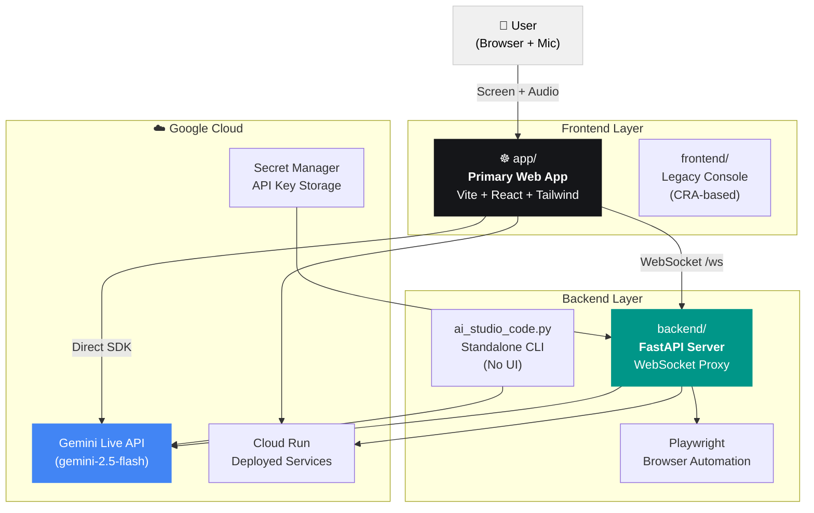

# Cygnus ☸️

Cygnus is a real-time, multimodal AI travel companion built with the **Google Gemini Live API**. It monitors a user's browser via screen sharing, detects when they are booking international flights, and proactively provides passport validity rules and entry requirements — all through natural voice conversation.

Cygnus solves a very real problem: nearly 40% of travelers are unaware that passport requirements vary by destination, leading to boarding denials and lost travel costs. Cygnus acts as a "UI Navigator" — it watches your screen, listens to your voice, and takes action when it detects an international flight booking.


---

## 📋 Table of Contents

- [🗂️ Project Architecture](#️-project-architecture)
- [🔑 Prerequisites](#-prerequisites)
- [⚙️ Setup](#️-setup)
- [🚀 Running the Project](#-running-the-project)
  - [Option A: Primary Web App](#option-a-primary-web-app-recommended)
  - [Option B: Full Stack (App + Backend)](#option-b-full-stack-app--backend)
  - [Option C: Standalone Python CLI](#option-c-standalone-python-cli)
- [☸️ Testing Instructions](#️-testing-instructions)
  - [Test 1: Application Launch & Health Check](#-test-1-application-launch--health-check)
  - [Test 2: Session Start & Permission Grants](#-test-2-session-start--permission-grants)
  - [Test 3: International Flight Detection](#-test-3-international-flight-detection-core-feature)
  - [Test 4: Domestic Flight Exclusion](#-test-4-domestic-flight-exclusion)
  - [Test 5: Voice Interaction & Verbal Consent](#-test-5-voice-interaction--verbal-consent)
  - [Test 6: Manual Intent Input](#-test-6-manual-intent-input)
  - [Test 7: Virtual Cursor Animation](#-test-7-virtual-cursor-animation)
  - [Test 8: Session Stop & Cleanup](#-test-8-session-stop--cleanup)
- [🛠️ How It Works](#️-how-it-works)
- [🚀 What's Next for Cygnus](#-whats-next-for-cygnus)

---


## 🗂️ Project Architecture



The **`app/`** directory is the current, primary interface. It uses the `@google/genai` SDK (v1.29+) to connect directly to Gemini Live for screen + audio streaming.

---

## 🔑 Prerequisites

| Requirement | Version | Notes |
|---|---|---|
| Node.js | 18+ | Required for `app/` and `frontend/` |
| Python | 3.9+ | Required for `backend/` and `ai_studio_code.py` |
| Google Chrome/Edge | Latest | Screen sharing requires a modern Chromium browser |
| Gemini API Key | — | Get one at [aistudio.google.com/app/apikey](https://aistudio.google.com/app/apikey) |

**Required Browser Permissions**: Screen Sharing (Display Capture), Microphone

---

## ⚙️ Setup

### 1. Clone & Configure Environment

```bash
git clone https://github.com/alissatroiano/cygnus-ai.git
cd cygnus-ai
```

Create a `.env` file in the **root** directory:

```env
GEMINI_API_KEY="your_api_key_here"
PROJECT_ID='your_gcp_project_id'
REACT_APP_GEMINI_API_KEY="your_api_key_here"
GEMINI_API_VERSION="v1beta"
REACT_APP_BACKEND_URL="https://cygnus-backend-rhay27pzoq-uc.a.run.app"
```

Create a `.env` file in the **`app/`** directory:

```env
GEMINI_API_KEY="your_api_key_here"
VITE_BACKEND_URL="https://cygnus-backend-rhay27pzoq-uc.a.run.app"
```

### 2. Install Dependencies

**App (Primary Web UI):**
```bash
cd app
npm install
```

**Backend (Python):**
```bash
# From the root directory
pip install -r requirements.txt
# Install Playwright browsers
playwright install chromium
```

**Legacy Frontend (Optional):**
```bash
cd frontend
npm install
```

---

## 🚀 Running the Project

### Option A: Primary Web App (Recommended)

This runs the new Vite-based app that connects directly to the Gemini Live API.

```bash
cd app
npm run dev
```

Then open **[http://localhost:3000](http://localhost:3000)** in your browser.

> **Important**: The app must be served over a local server (not opened directly as a file). `npm run dev` handles this correctly.

---

### Option B: Full Stack (App + Backend)

Use this if you want the Playwright-powered browser automation (backend handles `navigate_to_url`, `scroll_window`, `click_element` tool calls).

**Terminal 1 — Backend:**
```bash
# From the root directory
call cygnusVenv\Scripts\activate  # Windows
# source cygnusVenv/bin/activate  # macOS/Linux
uvicorn backend.main:app --reload --port 8000
```

**Terminal 2 — App:**
```bash
cd app
npm run dev
```

Alternatively, use the one-click launcher (Windows only):
```bash
run_all.bat
```

---

### Option C: Standalone Python CLI

No browser UI required. Uses the terminal for text input and your microphone/screen directly.

```bash
# Screen sharing mode (default)
python ai_studio_code.py --mode screen

# Webcam mode
python ai_studio_code.py --mode camera
```

---

## ☸️ Testing Instructions

These tests verify all major features of Cygnus. Run them in order, starting with the setup tests.

---

### ✅ Test 1: Application Launch & Health Check

**Purpose:** Verify the app loads and the API key is configured correctly.

1. Start the app: `cd app && npm run dev`
2. Open **http://localhost:3000** in Chrome or Edge.
3. **Expected:** The Cygnus header loads. The **System Standby** indicator (red dot) is visible in the top-right.
4. Open DevTools (F12), go to the **Console** tab.
5. **Expected:** No critical errors in console.

**Backend health check (if running):**
```
GET https://cygnus-backend-rhay27pzoq-uc.a.run.app/api/health
```
**Expected response:** `{ "status": "healthy", "gemini_api_key_configured": true }`

---

### ✅ Test 2: Session Start & Permission Grants

**Purpose:** Verify browser permissions are correctly requested and screen sharing initializes.

1. Click the **"Start Monitoring"** button (top right of the app).
2. **Expected:** Your browser will prompt for two permissions:
   - **Screen Sharing** — Select a browser window or tab to share (any window works).
   - **Microphone** — Grant microphone access.
3. **Expected after granting both:**
   - The **System Standby** indicator turns green and shows **"System Active"**.
   - The video stream of your shared screen appears in the large center panel.
   - The **System Logs** panel (bottom right) shows: `Starting monitoring...` and then either `Connecting to backend...` (if backend URL is set) or `Connecting to Gemini Live...`.

**Failure Scenarios:**
- If you click "Don't Allow" on screen sharing → A red error banner appears: *"Screen sharing permission was denied."*
- If you click "Don't Allow" on microphone → A red error banner appears: *"Microphone permission was denied."*

---

### ✅ Test 3: International Flight Detection (Core Feature)

**Purpose:** Verify Cygnus autonomously detects an international flight booking and provides passport advisory.

1. Start the session (Test 2 complete).
2. Share a browser tab where you can open a new page.
3. Navigate the **shared tab** to [Google Flights](https://www.google.com/flights).
4. Search for an international destination, e.g., **"New York to Tokyo"** or **"NYC to Paris"**.
5. Wait 2–5 seconds after the flight results appear on screen.

**Expected Results:**
- 🎙️ **Voice Alert (Audio):** Cygnus speaks through your speakers: *"I noticed you're looking at international flights to [Destination]. Did you know most flights canceled due to passport issues are simply caused by lack of awareness of entry requirements?"*
- 📋 **Agent Thought Stream:** The text of Cygnus's response appears in the **Agent Thought Stream** panel (bottom of the screen view).
- 🎯 **Destination Card:** A passport requirements card appears overlaid on the screen stream showing:
  - **Passport Validity**: e.g., "6 months beyond travel date"
  - **Blank Pages**: e.g., "At least 1 blank page"
  - **Visa Required**: e.g., "Not required for stays under 90 days"
- 📊 **Navigation Feed:** An **Alert** entry appears in the Navigation Feed panel.

---

### ✅ Test 4: Domestic Flight Exclusion

**Purpose:** Verify Cygnus correctly identifies domestic flights and stays silent.

1. With the session active, navigate the shared tab to [Google Flights](https://www.google.com/flights).
2. Search for a **domestic** flight, e.g., **"New York to Los Angeles"**.

**Expected Results:**
- 🎙️ **Voice Response:** Cygnus says: *"I am an international travel advisor, so I don't think you need my help. Enjoy your travels!"*
- ❌ **No destination card appears.**

---

### ✅ Test 5: Voice Interaction & Verbal Consent

**Purpose:** Verify Cygnus responds correctly to user voice.

1. With session active and an international flight detected, Cygnus will ask: *"Would you like to check the specific entry requirements for your destination?"*
2. Say **"Yes, please"** or **"Sure"** out loud into your microphone.

**Expected Results:**
- Cygnus provides detailed verbal requirements for the destination country.
- The destination card in the UI updates with structured data.

3. Optionally say: **"Can you open the government website for me?"**

**Expected Results:**
- 🌐 **Tab Opens:** A new browser tab opens to `https://travel.state.gov/en/international-travel.html`.
- 📊 **Navigation Feed:** A **Navigate** entry appears in the Navigation Feed panel, logging the URL.

---

### ✅ Test 6: Manual Intent Input

**Purpose:** Verify the text input field for sending manual commands to the AI.

1. With the session active, locate the **"Manual Intent (Optional)"** text area on the right side.
2. Type: `Check the entry requirements for Japan`
3. Click **"Send Intent"**.

**Expected Results:**
- The intent is sent to the Gemini session.
- 🎙️ **Voice Response:** Cygnus verbally provides Japan's entry requirements.
- 📋 **Agent Thought Stream:** The response text appears in the stream panel.

---

### ✅ Test 7: Virtual Cursor Animation

**Purpose:** Verify the visual cursor renders correctly when Cygnus performs click actions.

1. With the session active and the shared screen visible in the app, ask Cygnus verbally: *"Can you find the search button?"*

**Expected Results:**
- 🖱️ **Virtual Cursor:** An animated cursor (white pointer icon with a pulsing ring) appears and moves to the approximate location of the button in the stream panel.
- 📊 **Navigation Feed:** A **Click** entry appears with the description of the element clicked.

---

### ✅ Test 8: Session Stop & Cleanup

**Purpose:** Verify the app cleans up properly when a session ends.

1. Click the **"Stop Session"** button (top right, red button, only visible when active).

**Expected Results:**
- The **System Active** indicator returns to red **"System Standby"**.
- The screen stream disappears and the placeholder panel is shown.
- The **"Start Monitoring"** button reappears.
- In the **System Logs:** `Gemini Live closed` or `Backend Closed` appears.

---

## 🛠️ How It Works

| Layer | Tech | Role |
|---|---|---|
| **Vision** | Gemini 2.5 Flash | Processes real-time screen frames (1fps JPEG) |
| **Audio In** | WebAudio API (16kHz PCM) | Streams microphone audio to Gemini Live |
| **Audio Out** | WebAudio API (24kHz PCM) | Plays back Gemini's AI voice response |
| **UI** | Vite + React 19 + Tailwind CSS v4 | Real-time dashboard and visual cursor |
| **Automation** | FastAPI + Playwright (backend) | Handles browser tool calls (navigate, click, scroll) |
| **AI Tools** | `update_destination_info`, `open_url`, `click_element`, `type_text` | AI-callable functions that update the UI or open URLs |

---

## 🚀 What's Next for Cygnus

- **Cross-App Workflows**: Moving beyond the browser to navigate desktop applications.
- **Automated Document Scanning**: Visually checking a user's physical passport via webcam to compare against destination requirements.
- **Mobile Navigator**: Bringing the UI Navigator to mobile devices for on-the-go travel assistance.
